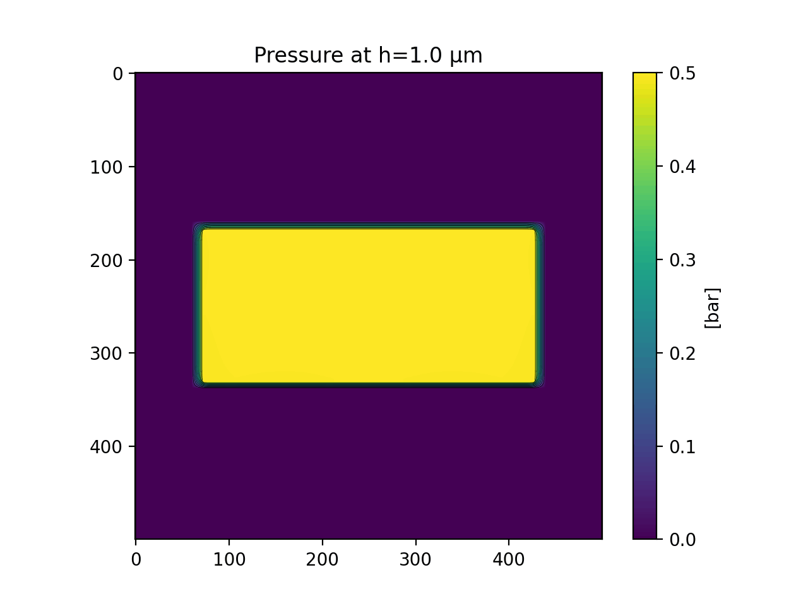
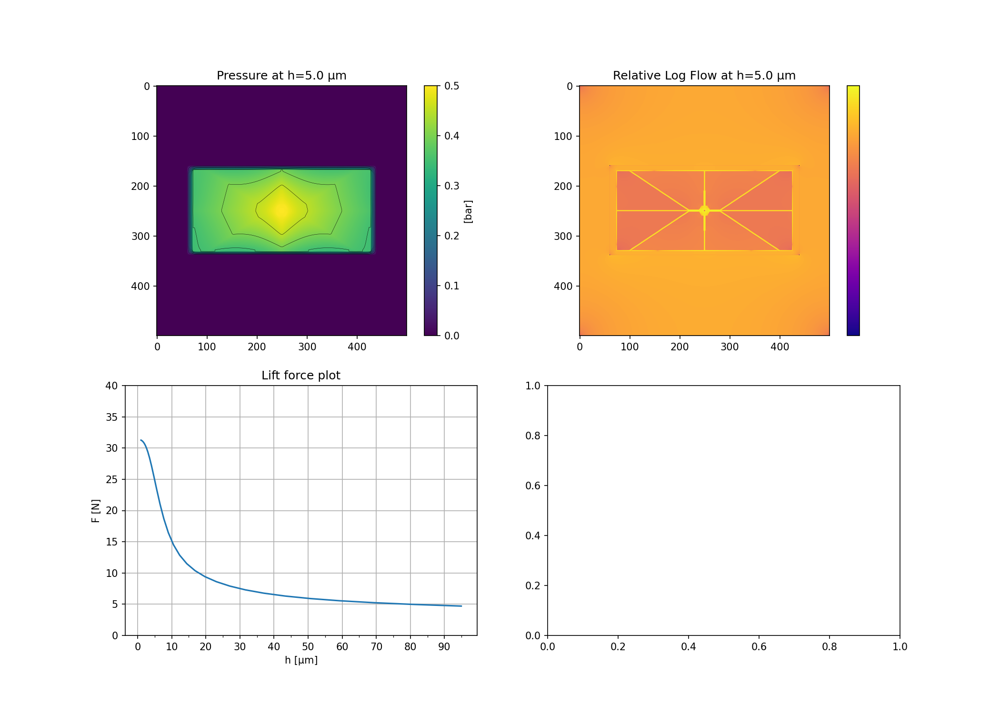

Welcome to the Open Air Bearings repository! This repository provides techniques and simulation software for air bearings. Open air bearings are mechanical devices that support components using a thin film of air, eliminating the need for solid contact and reducing friction to almost zero.

Here you can see a working prototype in action:

](https://www.youtube.com/watch?v=c7A6QDj5Lbw)

# Simulation for planar air bearing pads

The simulation folder contains a small and simple python programs to simulate planar air bearings with grooves and pressure inlets from a given design provided as an image file and outputs:
1. A plot of the lift force vs gap height, allowing to optimize the design for stiffness and to select an optimal preload value.
2. The pressure distribution for a reference gap height as a false color image
3. The relative flow rates under the air bearing pad as a false color image
4. A animated gif of the pressure distribution for varying gap heights

The simulation uses a simple pipe network model were neighbouring pixels are connected via pipes with flow rate resitrictions derived from the input design. A solution is then computed by solving the associated poisson equation.

Pressure distribution for varying gap heights animiation:

Pressure distribution, relative flow, lift force plot:

# DIY Glas Airbearing pads

coming soon...

# Ways to contribute ?

1. Try it out the simulator or build yourself some air bearings and give feedback
2. If you know fluid mechanics, please check the simulation for correctness
3. Write documentation and tutrials that explain hte usage of the simulation

